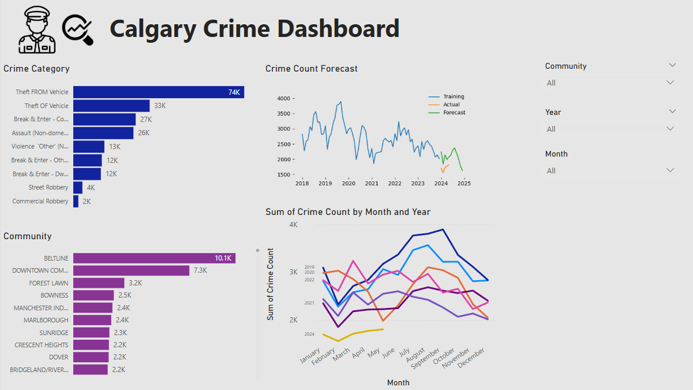

# Calgary Crime Forecast  
**Data Analytics Project**

## 🧭 Goal  
Predict crime occurrences in Calgary using machine learning and historical crime data.  
The objective was to identify **seasonal** and **geographic patterns** to help local authorities make informed decisions for **resource allocation** and **crime prevention strategies**.

## 🛠️ Key Technologies and Tools

- **Programming:** Python (Pandas, NumPy)  
- **Data Visualization:** Power BI, Matplotlib, Seaborn  
- **Development Environment:** Visual Studio Code, Jupyter Notebook, GitHub

## 📌 Project Highlights

- Collected and prepared historical crime data from Calgary’s open data portal.
- Performed exploratory data analysis to examine:
  - Distribution of crime types over time.
  - Patterns in specific sectors and communities.
- Created an interactive dashboard in Power BI featuring:
  - **Bar and line charts** showing monthly and yearly crime trends.
  - **Filters** to explore data by crime type, community, year, and month.
  - **Custom visuals** to support stakeholder decision-making.
- Built machine learning models in Python to forecast crime trends using time-series analysis.
- Shared the project through GitHub and Power BI Service for broader accessibility.

## 📊 Key Insights

- 🔁 **Seasonality:** Crime rates were higher during spring and summer, and lower during colder months.
- 📍 **High-Crime Areas:** Communities such as **Downtown Commercial Core** and **Beltline** showed consistently high crime rates.
- 🔮 **Forecasting:** The model successfully identified expected crime increases during holidays and weekends.

## 📸 Dashboard Snapshot

 <!-- Substitua pelo caminho correto do print -->

## 🚀 Next Steps

- Add external variables (e.g. weather, events, demographics) to enrich predictive power.
- Automate dashboard updates and model retraining using new data.
- Share insights with public safety officials for operational planning.

## 📎 Repository Structure

```plaintext
├── data/                  # Historical crime datasets
├── notebooks/             # Python scripts and notebooks
├── dashboard/             # Power BI (.pbix) file
├── visuals/               # Dashboard screenshots
├── README.md              # Project documentation
